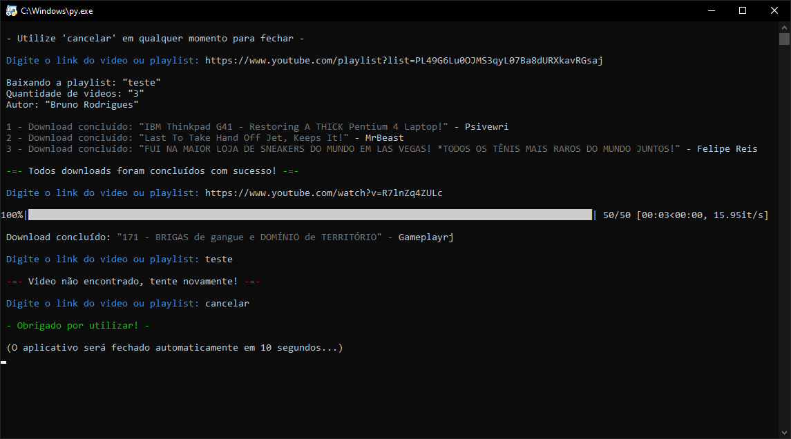

# Youtube Video Downloader

>Versão Normal e Lite

Projeto construído utilizando python, para baixar vídeos ou playlists diretamente do youtube em alta qualidade facilmente. É necessario ter o python instalado em seu computador e todas as bibliotecas da versão desejada (Normal ou Lite).

[Clique aqui para acessar](https://github.com/brunorodriguescabral/YT_Downloader)

## 📩 Contatos

- E-mail: rodrigues25704@gmail.com 
- GitHub: github.com/brunorodriguescabral
- Discord: rodrigues#0188

## 👨‍💻 Tecnologias Utilizadas

- Python
- Git e GitHub

## 📚 Bibliotecas (Normal)

- Time
- Pytube (pip install pytube)
- Colorama (pip install colorama)
- Tqdm (pip install tqdm)

## 📚 Bibliotecas (Lite)

- Time
- Pytube (pip install pytube)